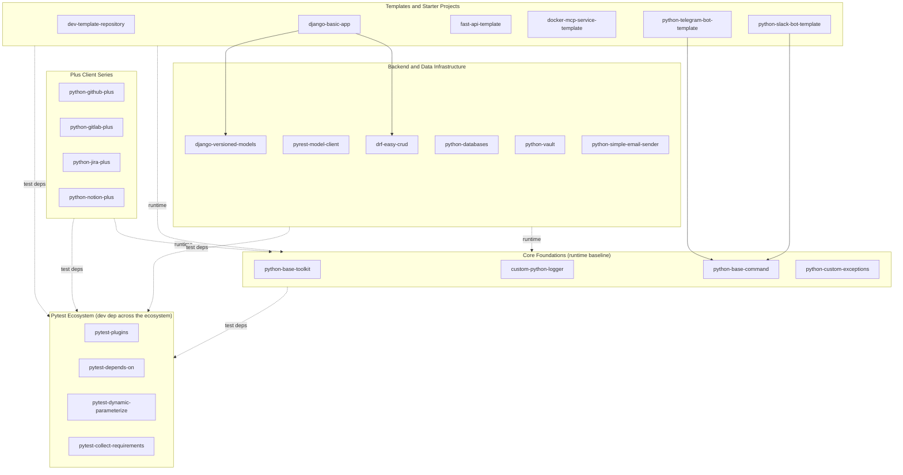

# Avi's Python Library Ecosystem

Reference for picking the right library from `github.com/aviz92/`. Fetch the relevant package's README before writing integration code.

## Naming Conventions

- `python-*-plus` — enhanced API clients
- `custom-python-*` — reusable utilities
- `pytest-*` — pytest plugins
- `*-template` / `python-*-template` — starter scaffolds
- Repo path: `github.com/aviz92/<package-name>` · PyPI: `pypi.org/project/<package-name>` (where published)

## Decision Guide

| Need to... | Reach for |
|---|---|
| Build a CLI / automation command | `python-base-command` |
| Add logging | `custom-python-logger` |
| Define semantic exceptions | `python-custom-exceptions` |
| Talk to GitHub API | `python-github-plus` |
| Talk to GitLab API | `python-gitlab-plus` |
| Talk to Jira API | `python-jira-plus` |
| Talk to Notion API | `python-notion-plus` |
| Build Django REST backend | Scaffold from `django-basic-app`; CRUD via `drf-easy-crud`; data versioning via `django-versioned-models` |
| Build FastAPI service | Scaffold from `fast-api-template` |
| Build MCP service | Scaffold from `docker-mcp-service-template` |
| Build Telegram bot | Scaffold from `python-telegram-bot-template` |
| Build Slack bot | Scaffold from `python-slack-bot-template` |
| Create new repo | Scaffold from `dev-template-repository` |
| Manage secrets | `python-vault` |
| Send email / attachments | `python-simple-email-sender` |
| Talk to multiple DB types through one API | `python-databases` |
| Type-safe REST calls | `pyrest-model-client` |
| Enforce test dependency order | `pytest-depends-on` |
| Parameterize tests dynamically | `pytest-dynamic-parameterize` |
| Better test reports + CI utilities | `pytest-plugins` |
| Map requirements → tests | `pytest-collect-requirements` |

## Common Combos

- **CLI / automation tool**: `python-base-command` + `custom-python-logger` + `python-custom-exceptions`
- **Default pytest suite**: `pytest-plugins` + `pytest-dynamic-parameterize` + `pytest-depends-on` (add `pytest-collect-requirements` when traceability is needed)
- **Django REST backend**: `django-basic-app` scaffold → `drf-easy-crud` + `django-versioned-models` + Core Foundations
- **FastAPI service**: `fast-api-template` scaffold → Core Foundations
- **Chat bot (Telegram / Slack)**: corresponding `*-bot-template` → `python-base-command` + Core Foundations
- **External-API integration script**: relevant `*-plus` client + Core Foundations
- **Secret-consuming service**: `python-vault` + Core Foundations

## Ecosystem Architecture

**Legend**: solid arrow = direct import at runtime · `runtime` dashed = group-level runtime dep on Core · `test deps` dashed = group-level dev/test dep on Pytest Ecosystem.

## Catalog

> `stable` = published to PyPI · `active` = GitHub-only, still evolving.

**Pytest Ecosystem**
- `pytest-plugins` `[stable]` — Enhanced reporting and smart CI utilities.
- `pytest-depends-on` `[stable]` — Explicit test dependency management with automatic re-ordering.
- `pytest-dynamic-parameterize` `[stable]` — Dynamic, function-based test parameterization.
- `pytest-collect-requirements` `[stable]` — Requirement-to-test traceability mapping.

**"Plus" Client Series**
- `python-github-plus` `[stable]` — GitHub client with improved PR workflows and resilient error management.
- `python-gitlab-plus` `[stable]` — GitLab client optimized for MR and branch lifecycle management.
- `python-jira-plus` `[stable]` — JIRA client with pagination, metadata validation, robust error handling.
- `python-notion-plus` `[stable]` — Notion API client focused on DX and intuitive data handling.

**Backend & Data Infrastructure**
- `drf-easy-crud` `[stable]` — CRUD automation for DRF with filtering and standardized methods.
- `pyrest-model-client` `[stable]` — Type-safe, model-driven REST client.
- `django-versioned-models` `[active]` — Release management and data versioning for Django models.
- `python-databases` `[stable]` — Unified interface for multiple database types through a single API.
- `python-vault` `[stable]` — HashiCorp Vault wrapper for AppRole auth and KV secrets.
- `python-simple-email-sender` `[stable]` — Minimalist SMTP client with zero boilerplate.

**Core Foundations**
- `python-base-toolkit` `[stable]` — Production-ready suite of essential utilities.
- `custom-python-logger` `[stable]` — Flexible logger with colored output and custom levels.
- `python-base-command` `[stable]` — Base abstraction for structured CLI and automation commands.
- `python-custom-exceptions` `[stable]` — Reusable semantic exception classes.

**Templates & Starter Projects**
- `dev-template-repository` `[active]` — Standardized GitHub repo template with tooling, CI, structure.
- `django-basic-app` `[active]` — DRF starter with CRUD utilities, versioned models, advanced filtering.
- `fast-api-template` `[active]` — FastAPI starter with auth, JWT, database, example routes.
- `docker-mcp-service-template` `[active]` — Dockerized MCP service with Claude Desktop integration.
- `python-telegram-bot-template` `[active]` — Modular Telegram bot with async handlers, inline keyboards.
- `python-slack-bot-template` `[active]` — Slack bot with Flask events, AI ticket classification, multi-LLM support.
